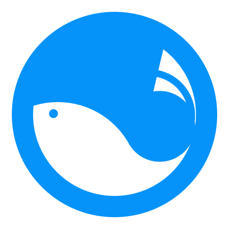

<p align="center">
  
<p>

# Jellyfish Bowl

<p align="center">
  <a href="https://shirsendu-bairagi.betteruptime.com">
    
  </a>
</p>


> Locality‑focused, talent marketplace app

- 📦 SSR
- 🖼️ OG Tags
- 🚀 PWA
- ✋ Push Notification
- 🌙 Light/Dark Mode
- 🐋 Containerized
- 🪄 CI/CD (Github Action)
- 🎭 Authentication (OAuth 2.0)
- ⚡️ API Route Caching
- 📐 Analytics

# Todo

- [ ] Add Testing

## External Dependencies

- gitleaks

## How to Deploy

1. Initialize Swarm on the Manager Node

```bash
docker swarm init --advertise-addr <MANAGER-IP>
```

2. Join Worker Nodes to the Swarm

```bash
docker swarm join --token <WORKER-TOKEN> <MANAGER-IP>:2377
```

3. Check Node Status

```bash
docker node ls
```

4. Create a docker volume

```bash
docker volume create \
  --name jellyfish-bowl_data \
  --driver local \
  --opt type=none \
  --opt device=~/Algostract/jellyfish-bowl/.data \
  --opt o=bind
```

5. Use Docker Stack to deploy multi-container application

```bash
docker stack deploy --compose-file docker-compose.prod.yml jellyfish-bowl
```

6. Scale service

```bash
docker service scale jellyfish-bowl_app=2
```

7. Verify

```bash
docker service ls
docker service ps jellyfish-bowl_app
```

## License

Published under the [GNU GPLv3](https://github.com/Algostract/jellyfish-bowl/blob/main/LICENSE) license.
<br><br>
<a href="https://github.com/Algostract/jellyfish-bowl/graphs/contributors">

</a>
